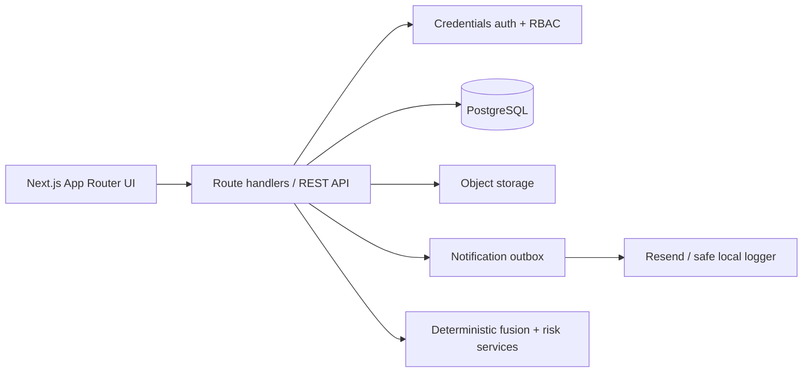
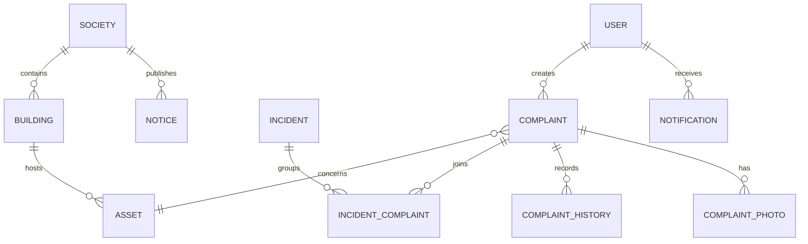

# Nivasa Pulse

**From complaints to community intelligence.** Nivasa Pulse is a maintenance command center for apartment societies: it turns individual resident reports into transparent, actionable maintenance incidents.

## What makes it different

- **Incident Fusion** links likely duplicate reports without silently merging them.
- **Asset Passports** give each lift, pump and shared facility a QR-ready reporting surface and history.
- **Risk Radar** uses an explainable, configurable 0–100 operational score—not pretend ML.
- **Resolution Proof** preserves before/after evidence, history, and resident reopening feedback.

## Access

Run `npm install` then `npm run dev`, and open `http://localhost:3000`.

| Role | Email | Password |
|---|---|---|
| Admin | admin@nivasa.pulse | nivasa2026 |
| Resident | resident@nivasa.pulse | nivasa2026 |

The seeded story is Tower B Lift 2: four reports fuse into `INC-2026-00042`, currently high-priority and at critical risk.

## Architecture



## Database model



## Local setup

1. Copy `.env.example` to `.env.local` and set production integrations when needed.
2. `npm install`
3. `npm run dev`

The current UI prototype is deliberately self-contained so the reviewer journey works without paid services. The production schema and API contract are documented in [`docs/DATABASE.md`](docs/DATABASE.md) and [`docs/API.md`](docs/API.md).

## Deployment

Deploy the Next.js app to Vercel or a Node host; configure PostgreSQL, object storage and Resend through environment variables. Set secure cookies, `NEXT_PUBLIC_APP_URL`, and run migrations before serving traffic.

See [`docs/DEPLOYMENT.md`](docs/DEPLOYMENT.md) for exact Vercel configuration and production smoke-test steps.

### Production database

```bash
npm run db:generate
npx prisma migrate deploy
npm run db:seed
```

The repository uses PostgreSQL through Prisma. Never commit `.env` or `.env.local`; both are ignored. The Cloudinary upload adapter validates JPEG/PNG/WebP file signatures and size limits before storing files.

## Design decisions

See [`docs/DECISIONS.md`](docs/DECISIONS.md), [`docs/ARCHITECTURE.md`](docs/ARCHITECTURE.md), and the evaluator walkthrough in [`docs/DEMO_SCRIPT.md`](docs/DEMO_SCRIPT.md).
